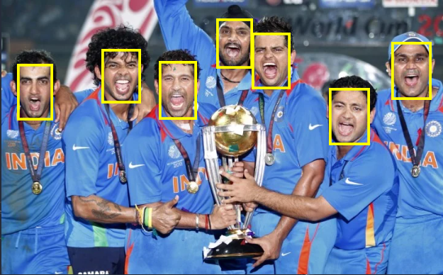

# Face Detector

Modified version of the final project of the course zero to mastery of web development.

The project uses the context API for state management and also uses react hooks, including useReducer and useContext. 

Face detection is done using the Clarifai API.

try out the app here

